## Mandelbrot Maker
----

### Basic Algorithm
The simplest algorithm for generating a representation of the Mandelbrot set is known as the `"escape time"` algorithm. A repeating calculation is performed for each x, y point in the plot area and based on the behavior of that calculation, a color is chosen for that pixel.

- For each (x, y), the locations are used as starting values in 
a repeating calculation.
- The result of each iteration is used as the starting value for the next iteration.
- The values are checked during each iteration to see whether they have reached a `critical escape condition` or `bailout`.
- If the value has not reached the critical escape condition, the iteration continues. Any pixel in the set will never escape the critical condition, hence there is a maximum number of iterations that can be performed.
---
### In terms of Complex Numbers
- $z_{n+1}=z_{n}^2+z_0$
    - where  $z_0 = x_0 + y_0i$
- $z_{n+1}=(x_n + y_ni)^2 + (x_0 + y_0i)$
- $z_{n+1}=(x_n^2 - y_n^2 + x_0) + (2x_ny_n + y_0)i$
- $x_{n+1}=x_n^2 - y_n^2 + x_0$
- $y_{n+1}=2x_ny_n + y_0$
---
### Psuedo Code
1. Unoptimized naive escape time algorithm
```bash
LIMIT = 4

for each pixel (Px, Py) do
    x0 := scaled(Px) # scaled x-coord of pixel (scaled to lie in the Mandelbrot X scale (mx, Mx))
    y0 := scaled(Py) # scaled y-coord of pixel (scaled to lie in the Mandelbrot Y scale (my, My))

    x := 0.0
    y := 0.0
    iteration := 0
    max_iteration := MAX_ITERATIONS
    while (x*x + y*y) <= LIMIT AND iteration < MAX_ITERATIONS do  # 2 mul
        x_temp := x*x - y*y + x0 # 2 mul
        y := (x+x)*y + y0  # = 2*x*y + y0 (to reduce one multiplication) # 1 mul
        x := x_temp
        iteration := iteration + 1
    

    if iteration < MAX_ITERATIONS then
        color := palette[iteration]
    else
        color := palette[0]  # generally black

    plot(Px, Py, color)

```
2. OPTIMIZED escape time algorithm
Above code uses an unoptimized while operation. Aboev one must perform 5 multiplications per iteration.

Following simplication can be done by simplifying the complex multiplication.

- $(iy+x)^2 = x^2 - y^2 + 2iyx$


```bash
for each pixel do
    ...
    x2 := 0
    y2 := 0

    while x2 + y2 <= LIMIT and iteration < MAX_ITERATIONS do
        x := x2 - y2 + x0
        y := (x2 +x2)*y2  + y0  # 1 mul
        x2 := x*x  # 1 mul
        y2 := y*y  # 1 mul
        ...
```


### Commandline Usage
```bash
go run cmd/cmd.go
      Flags: 
      -height int
            Height of the image (default 700)
      -hue float
            Hue offset of the image
      -iter int
            Max Iterations (default 1000)
      -mode string
            Mode of the image (options: seq, pixel, row, workers) (default "seq")
      -offsetX float
            Offset X of the image
      -offsetY float
            Offset Y of the image
      -out string
            Name of the output file with extension (default "mandelbrot.png")
      -quality int
            JPG Quality (default 100)
      -scale int
            Scale of the image (default 1)
      -threshold float
            Threshold for the mandelbrot set (default 4)
      -width int
            Width of the image (default 700)
      -workers int
            Number of workers to use (default 4)
      -zoom float
            Zoom of the image (default 1)
```

### HTTP Usage
```bash
go run server/server.go --port 8080

```

- navigate to http://localhost:8080/mandelbrot with flags as queryparams
- Example:
      - http://localhost:8080/mandelbrot?width=700&height=700&iterations=120&mode=pixel&out=.jpg&scale=1&threshold=1000&zoom=1000000&offsetX=0.243&offsetY=0.8115&hue=120&save=true

```

### Examples
```bash
go build -o ./build/mandel ./cmd/cmd.go && ./build/mandel \
    --out img/mandelbrot.png \
    --mode pixel \
    --scale 1 \
    --threshold 128 \
    --workers 8 \
    --iter 1000
```
`1x`
- `png`
- `406 KiloBytes`
- Using mode: pixel (one goroutine per pixel)
- Time taken to create image: 144.6938ms
- Time taken to save image: 80.7434ms
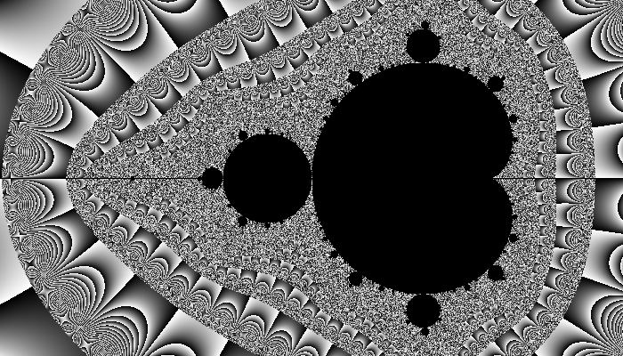

`1x`
- `jpg`
- iterations=1000
- threshold=1000
- zoom=1000
- hueOffset=200
- offsetX=0.7435
- offsetY=-0.1315
- Using mode: pixel (one goroutine per pixel)
- Time taken to create image: 144.6938ms
- Time taken to save image: 80.7434ms
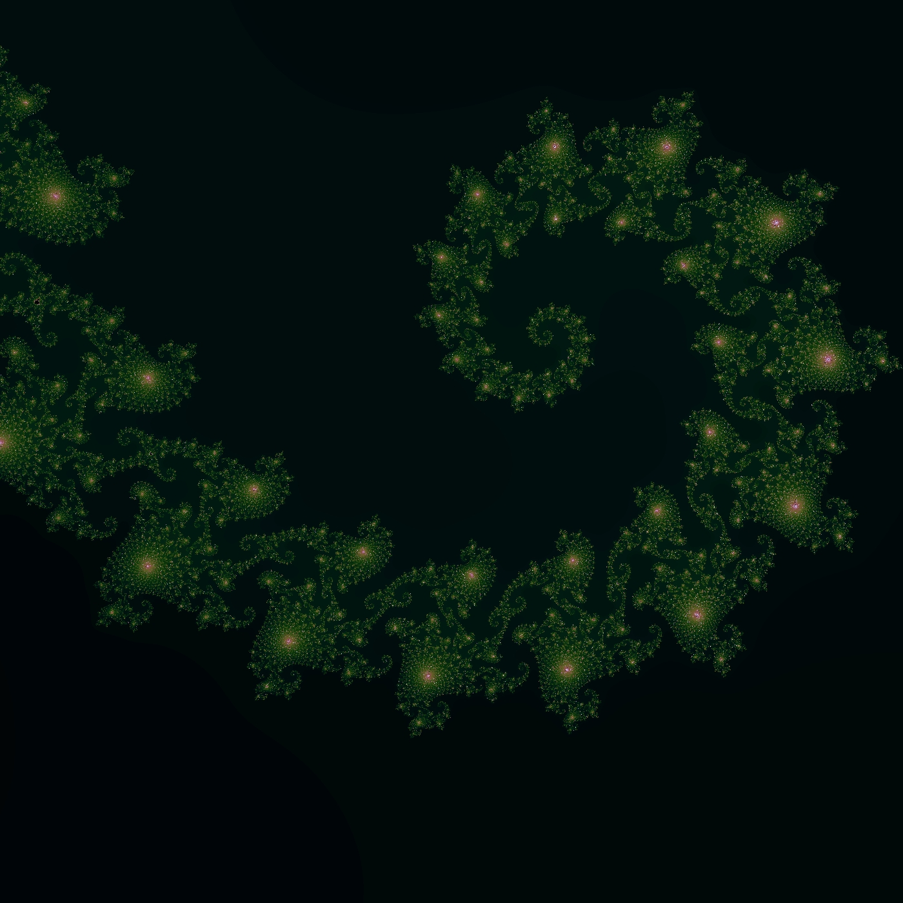


`10x`
- `jpg`
- `6.1 MegaBytes`
- Using mode: pixel (one goroutine per pixel)
- Time taken to create image: 14.6557209s
- Time taken to save image: 2.0148509s


### Gallery
- Image filenames contain the parameters, hover or open the images to see.
<div style="display:flex; flex-wrap: wrap; gap:5px;">
      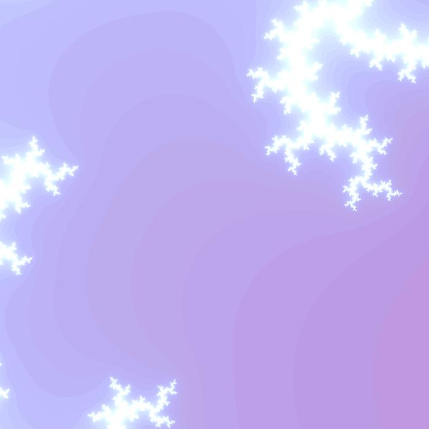
      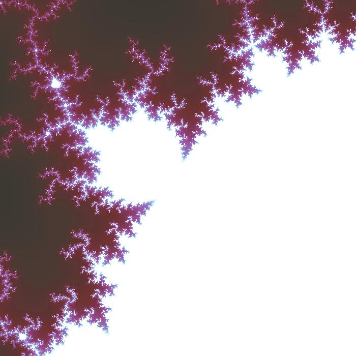
      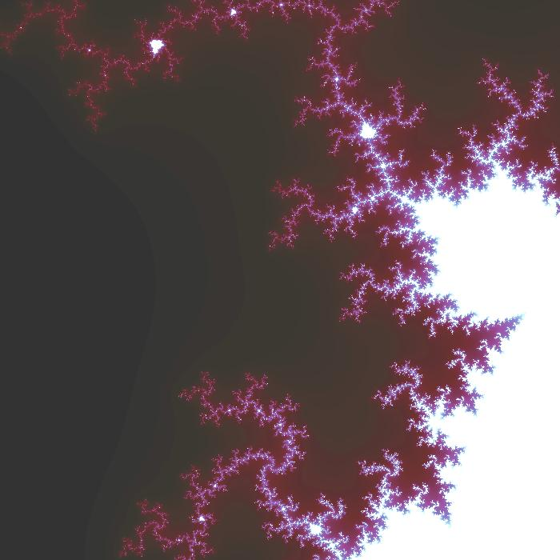
      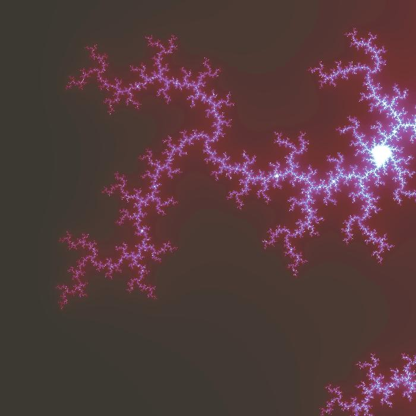
      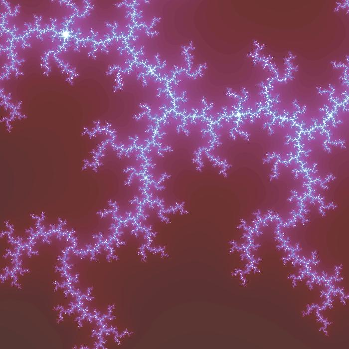
      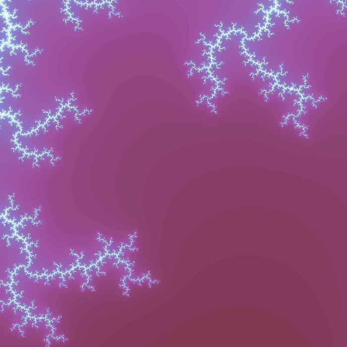
      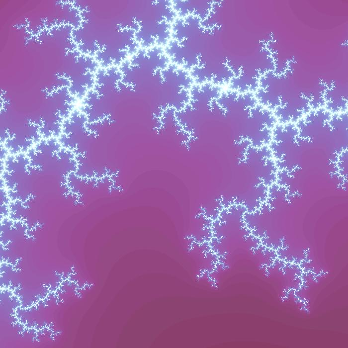
      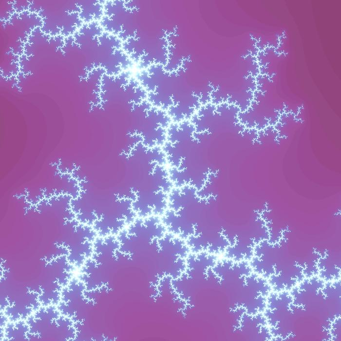
      
      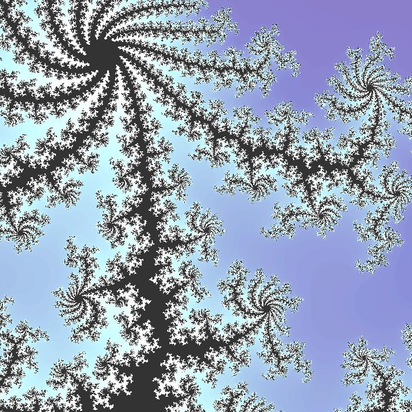
      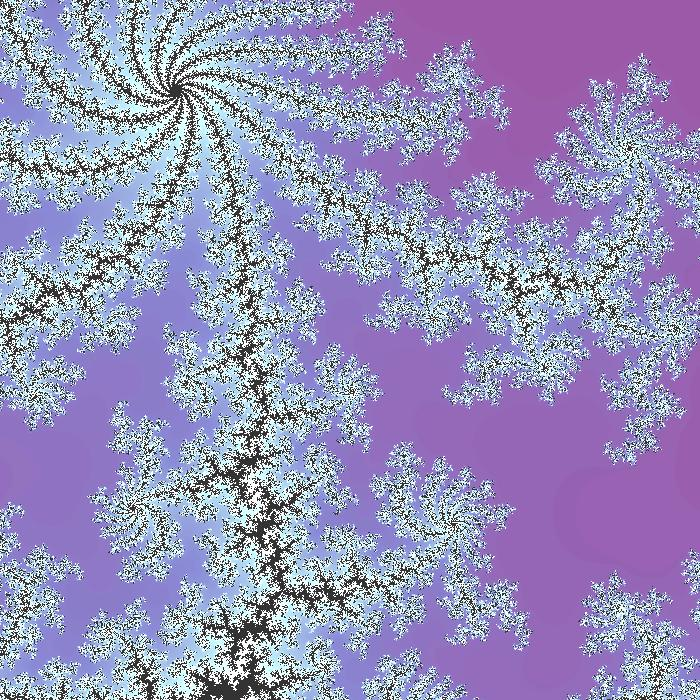
      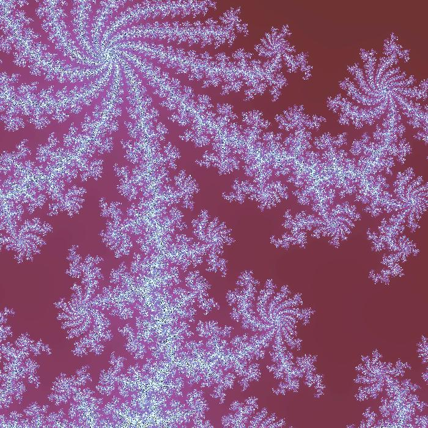
      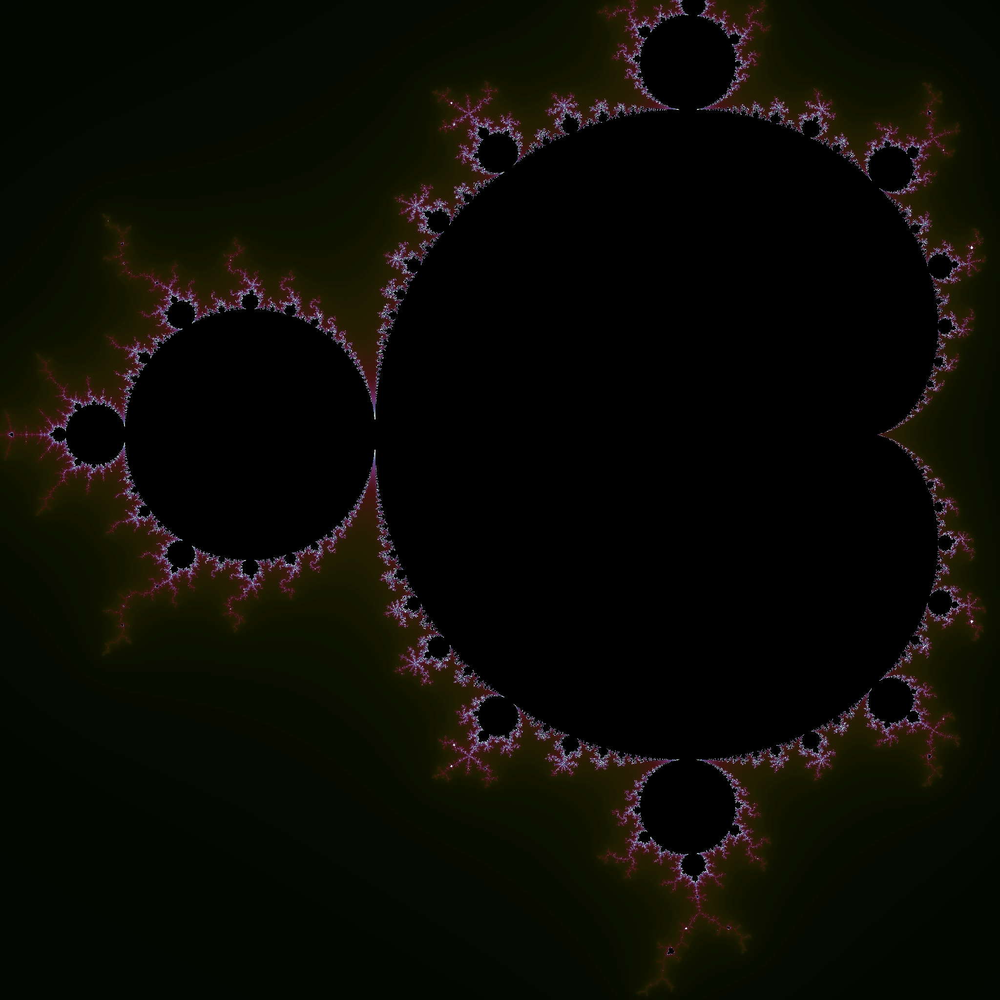
      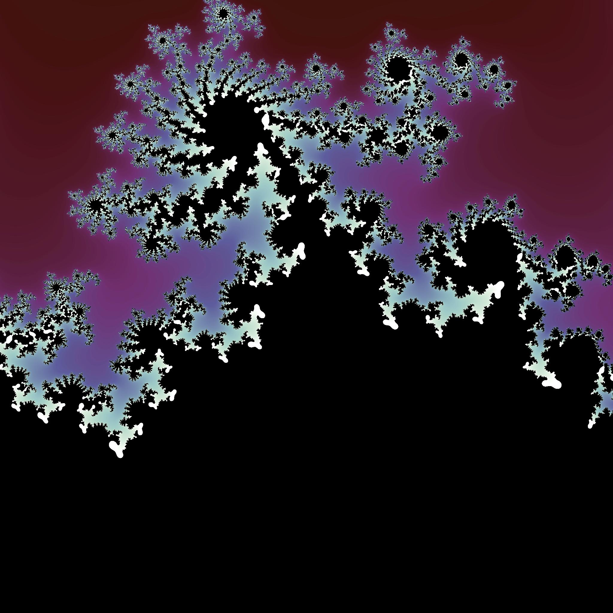
      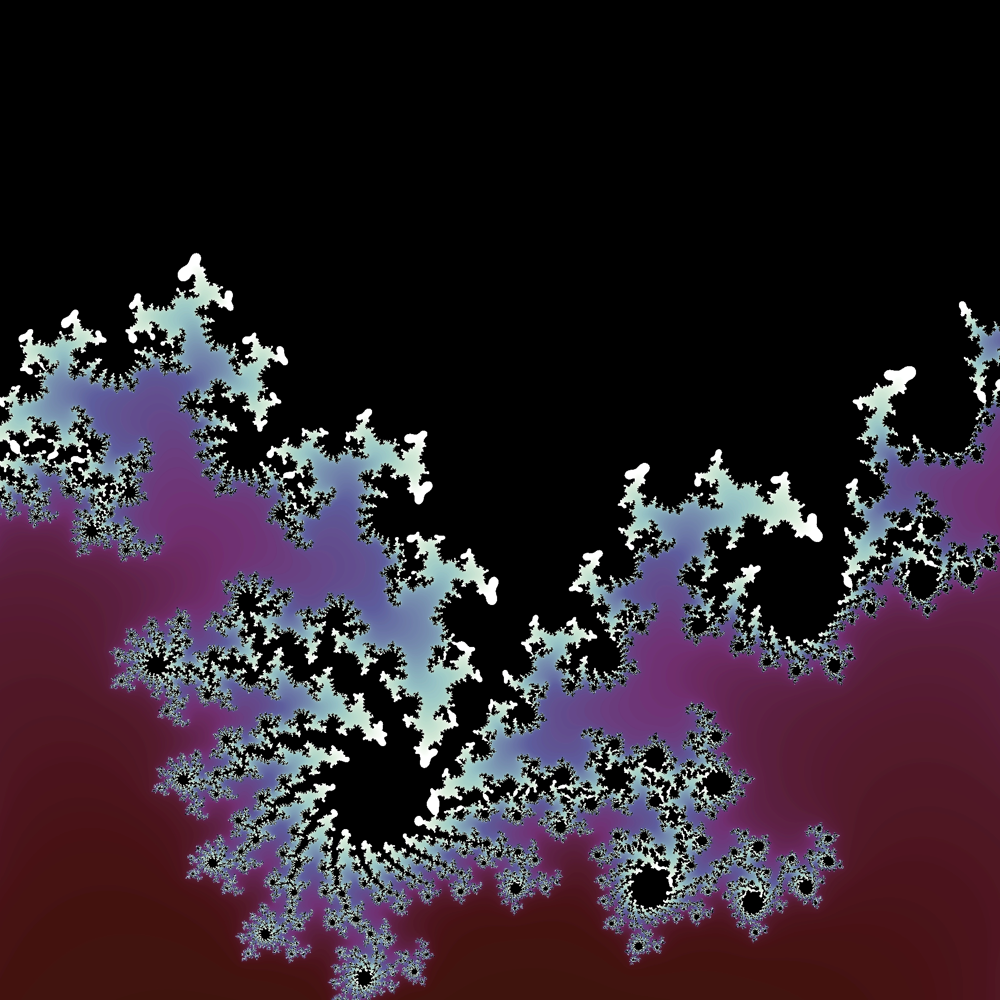
      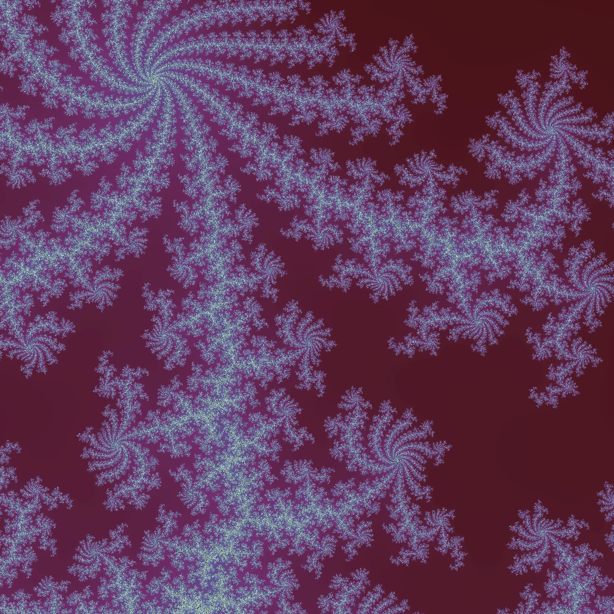
      
      
      
</div>


## References
- [Plotting algorithms for the Mandelbrot set](https://en.wikipedia.org/wiki/Plotting_algorithms_for_the_Mandelbrot_set)
- [campoy/mandelbrot](https://github.com/campoy/mandelbrot)
- [Draw the Mandelbrot Set in Python](https://realpython.com/mandelbrot-set-python/)
- [The Mandelbrot Set](https://complex-analysis.com/content/mandelbrot_set.html)
